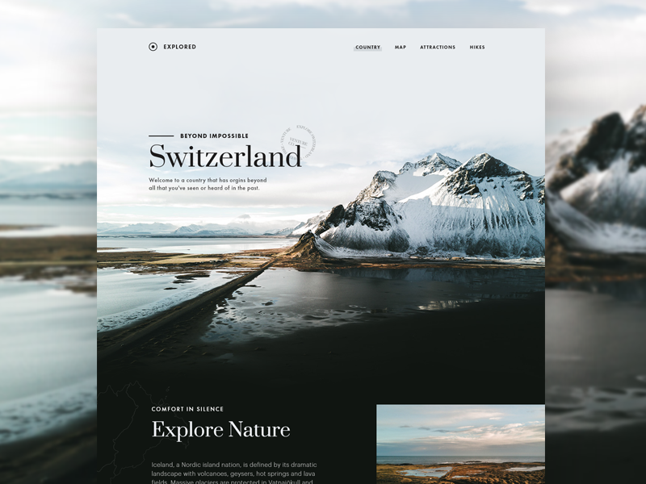

# Hiking Site

This is really an attempt to get a similar design that I found off [collectui.com](http://collectui.com/). This looks like a travel site and what really caught my attention was the usage of the blurry image in the back and the same image in the foreground. 

So what I learned from this project was the usage of putting images in the foreground. Originally it was difficult to blur the background image while making the image stay still while the user scrolled the page. So instead of using CSS for both of them, I blurred the image using photoshop and just imported that image. Then I used CSS's background-attachment: fixed to keep the image still while the user scrolled through the page. 

In addition, this was another great opportunity to practice my usage of flexbox and grids. Particularly as you see the image of the original design how it looks like the main content in the foreground extends pass the bottom of the site, so I decided to just be a bit creative and add information about the location that was being advertised. That was also the idea for deciding on making the background image fixed.

Original:

My attempt:

